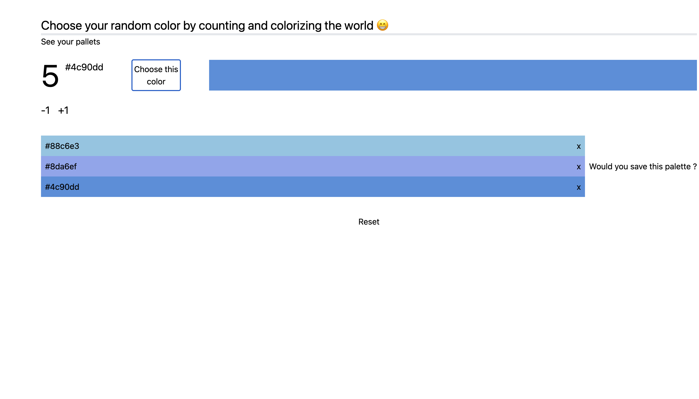

# Counter Color !

A simple counter that colorize numbers with random colors. Pick your favorite !

## Authors

- [@WillemJou](https://www.github.com/WillemJou)

## Languages

AND

## Features

Here is a funny little application allowing the creation of color palettes randomly, using a counter.
it is possible to change the color code (hexadecimal or rgb) and to copy the code when user clicking on it, and also create palettes of up to three colors for saving them to reuse later.

This project was bootstrapped with [Create React App](https://github.com/facebook/create-react-app).
